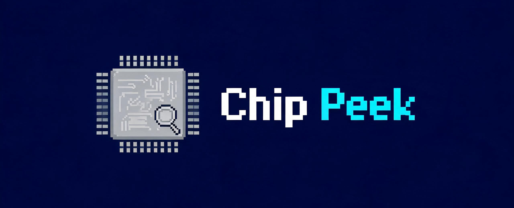

<div align="center">

# ChipPeek

### Lightweight Windows Hardware Monitoring Floating Widget

[](LICENSE)
[](https://github.com/Glimmer114514/ChipPeek)
[](#multi-language-support)
[](https://www.python.org/)
[](https://github.com/Glimmer114514/ChipPeek/stargazers)
[](https://github.com/Glimmer114514/ChipPeek/releases)

A lightweight, open-source **CPU / GPU temperature and frequency monitor** for Windows. \
Real-time hardware stats in a tiny always-on-top floating widget — works even over fullscreen games.



</div>

---

## Overview

ChipPeek is a minimal hardware monitoring tool that displays **CPU frequency, CPU temperature, GPU frequency, GPU temperature, VRAM usage, and memory usage** in a small floating widget on your desktop. It stays on top of all windows, including fullscreen games, so you can keep an eye on your hardware stats without alt-tabbing.

No bloat, no ads, no telemetry — just a clean, customizable overlay powered by [LibreHardwareMonitor](https://github.com/LibreHardwareMonitor/LibreHardwareMonitor).

---

## Table of Contents

- [Why ChipPeek?](#why-chippeek)
- [Features](#features)
- [Quick Start](#quick-start)
- [Usage](#usage)
- [System Requirements](#system-requirements)
- [Build as EXE](#build-as-exe)
- [Tech Stack](#tech-stack)
- [Project Structure](#project-structure)
- [Multi-language Support](#multi-language-support)
- [Contributing](#contributing)
- [License](#license)
- [Credits](#credits)

---

## Why ChipPeek?

There are many hardware monitoring tools out there. Here's how ChipPeek compares:

| Feature | ChipPeek | RTSS | HWiNFO | AIDA64 | Sidebar Diagnostics |
|---------|----------|------|--------|--------|---------------------|
| Price | Free / Open Source | Free | Free (Pro paid) | Paid | Free |
| Open Source | Yes | No | No | No | No |
| Floating widget | Yes | Yes (overlay) | No | Yes | Yes |
| Works in fullscreen | Yes | Yes | No | No | No |
| Lightweight (< 50 MB) | Yes | Yes | No | No | Yes |
| Multi-language (100+) | Yes | No | No | No | No |
| No install required | Yes | No | No | No | No |

ChipPeek is perfect for gamers, developers, and PC enthusiasts who want a **no-nonsense, always-visible hardware overlay** without the overhead of full system diagnostic suites.

---

## Features

- **Real-time monitoring**: CPU frequency, CPU temperature, GPU frequency, GPU temperature, VRAM usage, memory usage
- **Dual display modes**: Corner widget / Top bar, one-click switch
- **Always on top**: Stays above all windows, works in fullscreen games
- **Customizable display**: Freely choose which metrics to show, toggle between percentage/actual values
- **Auto-sizing**: Window width automatically adjusts to fit content
- **Adjustable style**: Window opacity, background transparency, font size all adjustable
- **Multi-language support**: 100+ languages, auto-detects system language
- **Convenient operation**: Left-drag to move, right-click menu for quick settings, auto snap to screen edges
- **Configurable sampling**: 200ms - 3000ms adjustable refresh rate
- **Auto start**: Launch automatically on Windows login
- **Low resource usage**: Minimal footprint in background
- **Portable**: No installation required — just run the EXE

---

## Quick Start

### Option 1: Download EXE (Recommended)

1. Go to [Releases](https://github.com/Glimmer114514/ChipPeek/releases)
2. Download `ChipPeek.exe`
3. Double-click to run (will automatically request admin privileges for CPU temperature and accurate frequency reading)

### Option 2: Run from Source

```bash
# Clone the repository
git clone https://github.com/Glimmer114514/ChipPeek.git
cd ChipPeek

# Install dependencies
pip install -r requirements.txt

# Run
python main.py
```

---

## Usage

### Basic Operations

| Action | Description |
|------|------|
| Left drag | Move window position |
| Right click | Open menu (switch mode / settings / exit) |
| Auto snap | Automatically snaps within 20px of screen edges |

### Display Modes

- **Corner Widget**: All metrics arranged vertically, can be placed at any screen corner
- **Top Bar**: All metrics arranged horizontally, centered at the top of the screen by default

### Settings

Right-click the widget to open the settings menu:

- **Display mode**: Corner widget / Top bar
- **Widget position**: Bottom right / Bottom left / Top right / Top left
- **Window opacity**: 30% - 100% overall window transparency
- **Background transparency**: 0% - 100% background transparent (text stays crisp)
- **Sampling interval**: 200ms - 3000ms data refresh rate
- **Font size**: 8 - 20 point font
- **Language**: 100+ languages, auto-detects system language
- **Display metrics**: Toggle each metric independently
- **Display format**: VRAM / Memory can toggle between percentage or actual values
- **Auto start**: Run automatically when logging into Windows

---

## System Requirements

- Windows 10 / Windows 11
- Administrator privileges (recommended), otherwise CPU temperature and accurate frequency may not be available
- .NET Framework 4.7.2 or higher (required by LibreHardwareMonitor)

---

## Build as EXE

```bash
pip install pyinstaller
pyinstaller --noconfirm --onefile --windowed --name "ChipPeek" --icon "app.ico" --manifest "admin.manifest" --add-data "libs;libs" --add-data "app.ico;." --hidden-import "clr" --hidden-import "pynvml" --hidden-import "win32gui" --hidden-import "win32con" main.py
```

After building, the EXE file is located at `dist/ChipPeek.exe`.

Or simply run the included `build.bat`.

---

## Tech Stack

| Component | Technology |
|-----------|-----------|
| GUI | Tkinter |
| Hardware data | LibreHardwareMonitorLib (via pythonnet), psutil, pynvml (NVIDIA GPU fallback) |
| System integration | pywin32 (window topmost, auto-start registry) |
| Internationalization | Custom JSON-based i18n system |
| Packaging | PyInstaller |

---

## Project Structure

```
ChipPeek/
├── main.py                  # Entry point
├── monitor_window.py        # Window UI and interaction logic
├── hardware_monitor.py      # Hardware data collection
├── config.py                # Configuration management
├── i18n.py                  # Internationalization
├── generate_icon.py         # Icon generation script
├── admin.manifest           # UAC admin privilege manifest
├── app.ico                  # Application icon
├── app.png                  # Icon preview
├── requirements.txt         # Python dependencies
├── build.bat                # Build script for PyInstaller
├── docs/                    # Multi-language README files
│   └── README_*.md
├── i18n/                    # Translation files (JSON)
│   └── *.json
├── libs/
│   └── lhm/
│       └── lib/net472/      # LibreHardwareMonitorLib DLL
└── dist/
    └── ChipPeek.exe         # Compiled executable
```

---

## Multi-language Support

ChipPeek supports **103 languages** — the configuration file (`config.json`) is saved in the same directory as the EXE, containing all adjustable settings. Settings are saved automatically when modified.

> **Other Languages**: [简体中文](docs/README_zh-CN.md) | [繁體中文](docs/README_zh-TW.md) | **English** | [日本語](docs/README_ja.md) | [한국어](docs/README_ko.md) | [Español](docs/README_es.md) | [Français](docs/README_fr.md) | [Deutsch](docs/README_de.md) | [Português](docs/README_pt.md) | [Русский](docs/README_ru.md) | [العربية](docs/README_ar.md) | [ไทย](docs/README_th.md) | [Tiếng Việt](docs/README_vi.md) | [Bahasa Indonesia](docs/README_id.md) | [Türkçe](docs/README_tr.md) | [Italiano](docs/README_it.md) | [Nederlands](docs/README_nl.md) | [Polski](docs/README_pl.md) | [हिन्दी](docs/README_hi.md) | [বাংলা](docs/README_bn.md) | [Svenska](docs/README_sv.md) | [Norsk](docs/README_no.md) | [Dansk](docs/README_da.md) | [Suomi](docs/README_fi.md) | [Čeština](docs/README_cs.md) | [Ελληνικά](docs/README_el.md) | [Magyar](docs/README_hu.md) | [Română](docs/README_ro.md) | [Українська](docs/README_uk.md) | [Slovenčina](docs/README_sk.md) | [Български](docs/README_bg.md) | [Hrvatski](docs/README_hr.md) | [Српски](docs/README_sr.md) | [Català](docs/README_ca.md) | [Slovenščina](docs/README_sl.md) | [Eesti](docs/README_et.md) | [Latviešu](docs/README_lv.md) | [Lietuvių](docs/README_lt.md) | [فارسی](docs/README_fa.md) | [Bahasa Melayu](docs/README_ms.md) | [اردو](docs/README_ur.md) | [தமிழ்](docs/README_ta.md) | [తెలుగు](docs/README_te.md) | [मराठी](docs/README_mr.md) | [ગુજરાતી](docs/README_gu.md) | [ਪੰਜਾਬੀ](docs/README_pa.md) | [ಕನ್ನಡ](docs/README_kn.md) | [മലയാളം](docs/README_ml.md) | [Қазақша](docs/README_kk.md) | [O'zbekcha](docs/README_uz.md) | [עברית](docs/README_he.md) | [မြန်မာဘာသာ](docs/README_my.md) | [ភាសាខ្មែរ](docs/README_km.md) | [ພາສາລາວ](docs/README_lo.md) | [Kiswahili](docs/README_sw.md) | [Afrikaans](docs/README_af.md) | [አማርኛ](docs/README_am.md) | [isiZulu](docs/README_zu.md) | [Filipino](docs/README_fil.md) | [Gaeilge](docs/README_ga.md) | [Íslenska](docs/README_is.md) | [Malti](docs/README_mt.md) | [Cymraeg](docs/README_cy.md) | [Euskara](docs/README_eu.md) | [Galego](docs/README_gl.md) | [नेपाली](docs/README_ne.md) | [සිංහල](docs/README_si.md) | [ქართული](docs/README_ka.md) | [Հայերեն](docs/README_hy.md) | [Македонски](docs/README_mk.md) | [Беларуская](docs/README_be.md) | [ייִדיש](docs/README_yi.md) | [Lëtzebuergesch](docs/README_lb.md) | [Esperanto](docs/README_eo.md) | [Føroyskt](docs/README_fo.md) | [Gàidhlig](docs/README_gd.md) | [Brezhoneg](docs/README_br.md) | [Corsu](docs/README_co.md) | [Rumantsch](docs/README_rm.md) | [Occitan](docs/README_oc.md) | [Asturianu](docs/README_ast.md) | [Frysk](docs/README_fy.md) | [Татарча](docs/README_tt.md) | [Башҡортса](docs/README_ba.md) | [Basa Jawa](docs/README_jv.md) | [Basa Sunda](docs/README_su.md) | [Cebuano](docs/README_ceb.md) | [བོད་སྐད](docs/README_bo.md) | [Kurdî](docs/README_ku.md) | [پښتو](docs/README_ps.md) | [سنڌي](docs/README_sd.md) | [Тоҷикӣ](docs/README_tg.md) | [Türkmen](docs/README_tk.md) | [Кыргызча](docs/README_ky.md) | [Монгол](docs/README_mn.md) | [Hausa](docs/README_ha.md) | [Igbo](docs/README_ig.md) | [Yorùbá](docs/README_yo.md) | [isiXhosa](docs/README_xh.md) | [Malagasy](docs/README_mg.md) | [chiShona](docs/README_sn.md) | [Kinyarwanda](docs/README_rw.md) | [Soomaali](docs/README_so.md)

Want to add or improve a translation? See [Contributing](#contributing).

<details>
<summary><b>📖 View descriptions in all 103 languages / 查看全部 103 种语言简介</b></summary>

<details>
<summary><b>East Asia / 东亚</b></summary>

- **简体中文**: 一款轻量级 Windows 硬件监控悬浮窗工具。支持 CPU/GPU 频率、温度、显存、内存占用实时监控，以悬浮窗形式常驻桌面，支持全屏置顶显示。
- **繁體中文**: 一款輕量級 Windows 硬體監控懸浮窗工具。支援 CPU/GPU 頻率、溫度、顯存、記憶體佔用即時監控，以懸浮窗形式常駐桌面，支援全畫面置頂顯示。
- **日本語**: 軽量なWindowsハードウェアモニタリングツール。CPU/GPUの周波数、温度、VRAM、メモリ使用率をリアルタイムで監視し、フルスクリーンアプリでも最前面に表示されます。
- **한국어**: 가벼운 Windows 하드웨어 모니터링 플로팅 위젯입니다. CPU/GPU 주파수, 온도, VRAM, 메모리 사용량을 실시간으로 모니터링하며 전체화면 앱 위에도 항상 표시됩니다.

</details>

<details>
<summary><b>Southeast Asia / 东南亚</b></summary>

- **ไทย**: วิดเจ็ตจอภาพฮาร์ดแวร์แบบลอยตัวที่เบาบางสำหรับ Windows ติดตามความถี่ CPU/GPU อุณหภูมิ VRAM และการใช้หน่วยความจำแบบเรียลไทม์ แสดงอยู่เหนือหน้าตาเสมอ รวมถึงแอปแบบเต็มหน้าจอ
- **Tiếng Việt**: Một tiện ích giám sát phần cứng nổi nhẹ cho Windows. Giám sát thời gian thực tần số CPU/GPU, nhiệt độ, VRAM và sử dụng bộ nhớ, luôn hiển thị trên cùng kể cả ứng dụng toàn màn hình.
- **Bahasa Indonesia**: Widget pemantauan perangkat keras mengambang yang ringan untuk Windows. Pemantauan real-time frekuensi CPU/GPU, suhu, VRAM, dan penggunaan memori, selalu di atas termasuk aplikasi layar penuh.
- **Bahasa Melayu**: Widget pemantauan perkakasan terapung yang ringan untuk Windows. Pemantauan masa nyata frekuensi CPU/GPU, suhu, VRAM dan penggunaan memori, sentiasa di atas, termasuk aplikasi skrin penuh.
- **Filipino**: Isang magaan na Windows hardware monitoring floating widget. Real-time na pagsubaybay sa dalas ng CPU/GPU, temperatura, VRAM, at paggamit ng memorya, laging nasa itaas kasama ang mga fullscreen app.
- **Basa Jawa**: Alat pemantau perangkat keras Windows sing entheng. Ngawasi real-time frekuensi CPU/GPU, suhu, VRAM, lan panggunaan memori, tansah ing ndhuwur kalebu aplikasi fullscreen.
- **Basa Sunda**: Alat pemantau parabot keras Windows anu énténg. Ngawasan real-time frékuénsi CPU/GPU, suhu, VRAM, jeung pamakéan mémori, tetep di luhur kaasup aplikasi fullscreen.
- **Cebuano**: Usa ka gamay nga himo sa pagbantay sa hardware sa Windows. Real-time nga pagbantay sa frequency sa CPU/GPU, temperatura, VRAM, ug pag-gamit sa memory, kanunay nga naa sa ibabaw lakip ang mga app sa fullscreen.
- **မြန်မာဘာသာ**: Windows အတွက် ပေါ့ပေါ့ဆ သော လွင့်ပျံသော ဟာ့ဒ်ဝဲ စောင့်ကြည့်မှု ဗီဂျက်။ CPU/GPU ကြိမ်နှုန်း၊ အပူချိန်၊ VRAM နှင့် မှတ်ဉာဏ်အသုံးပြုမှုကို အချိန်နှင့်တပြေးညီ စောင့်ကြည့်ပြီး ဖြည့်စွက်စခရင်အက်ပ်များတွင်ပင် အမြဲထိပ်တွင် ရှိနေသည်။
- **ភាសាខ្មែរ**: ឧបករណ៍តាមដានផ្នែករឹងអណ្តែតសម្រាប់ Windows ដែលមានទម្ងន់ស្រាល។ តាមដានប្រេកង់ CPU/GPU សីតុណ្ហភាព VRAM និងការប្រើប្រាស់មេម៉ូរីក្នុងពេលជាក់ស្តែង គឺនៅលើកំពូលជានិច្ច រួមទាំងក្នុងកម្មវិធីអេក្រង់ពេញ។
- **ພາສາລາວ**: ເຄື່ອງມືຕິດຕາມຮາດແວທີ່ເລື່ອຍໄດ້ສຳລັບ Windows ທີ່ມີນ້ຳໜັກເບົາ. ຕິດຕາມຄວາມຖີ່ CPU/GPU ອຸນຫະພູມ VRAM ແລະການນໍາໃຊ້ຫນ່ວຍຄວາມຈໍາໃນເວລາຈິງ ສະເໝີຢູ່ເທິງສຸດ ລວມທັງໃນແອັບໜ້າຈໍເຕັມ.

</details>

<details>
<summary><b>South Asia / 南亚</b></summary>

- **हिन्दी**: Windows के लिए एक हल्का फ्लोटिंग हार्डवेयर मॉनिटरिंग विजेट। CPU/GPU आवृत्ति, तापमान, VRAM और मेमोरी उपयोग की रियल-टाइम मॉनिटरिंग, फुलस्क्रीन ऐप्स सहित हमेशा सबसे ऊपर दिखाई देता है।
- **বাংলা**: Windows-এর জন্য একটি হালকা ফ্লোটিং হার্ডওয়্যার মনিটরিং উইজেট। CPU/GPU ফ্রিকোয়েন্সি, তাপমাত্রা, VRAM এবং মেমরি ব্যবহারের রিয়েল-টাইম মনিটরিং, ফুলস্ক্রিন অ্যাপস সহ সবসময় সবার উপরে থাকে।
- **தமிழ்**: Windows க்கான ஒரு இலகுரக மிதக்கும் கணினி மானிட்டர் சாதனம். CPU/GPU அதிர்வெண், வெப்பநிலை, VRAM மற்றும் நினைவகப் பயன்பாட்டின் உண்மை நேர மானிட்டரிங், முழு திரை பயன்பாடுகளுடன் எப்போதும் மேலே இருக்கும்.
- **తెలుగు**: Windows కోసం ఒక తేలికపాటి ఫ్లోటింగ్ హార్డ్వేర్ మానిటరింగ్ విడ్జెట్. CPU/GPU ఫ్రీక్వెన్సీ, ఉష్ణోగ్రత, VRAM మరియు మెమరీ వినియోగం యొక్క రియల్ టైమ్ మానిటరింగ్, ఫుల్ స్క్రీన్ యాప్‌లతో సహా ఎల్లప్పుడూ ఎగువన ఉంటుంది.
- **मराठी**: Windows साठी एक हलके वजनाचे फ्लोटिंग हार्डवेअर मॉनिटरिंग विजेट. CPU/GPU फ्रिक्वेन्सी, तापमान, VRAM आणि मेमरी वापराचे रिअल-टाइम मॉनिटरिंग, पूर्ण-स्क्रीन अॅप्ससह नेहमी वर राहते.
- **ગુજરાતી**: Windows માટે એક હળવું વજનનું ફ્લોટિંગ હાર્ડવેર મોનિટરિંગ વિજેટ. CPU/GPU ફ્રીક્વન્સી, તાપમાન, VRAM અને મેમરી વપરાશનું રીઅલ-ટાઇમ મોનિટરિંગ, ફુલ-સ્ક્રીન એપ્સ સહિત હંમેશા ટોચ પર રહે છે.
- **ਪੰਜਾਬੀ**: Windows ਲਈ ਇੱਕ ਹਲਕਾ ਭਾਰ ਦਾ ਫਲੋਟਿੰਗ ਹਾਰਡਵੇਅਰ ਮਾਨੀਟਰਿੰਗ ਵਿਜੇਟ. CPU/GPU ਫ੍ਰੀਕੁਐਂਸੀ, ਤਾਪਮਾਨ, VRAM ਅਤੇ ਮੈਮੋਰੀ ਵਰਤੋਂ ਦੀ ਰੀਅਲ-ਟਾਈਮ ਮਾਨੀਟਰਿੰਗ, ਫੁਲ-ਸਕ੍ਰੀਨ ਐਪਸ ਸਮੇਤ ਹਮੇਸ਼ਾ ਚੋਟੀ ਤੇ ਰਹਿੰਦਾ ਹੈ.
- **ಕನ್ನಡ**: Windows ಗಾಗಿ ಈಗಾದರೂ ಹಗುರವಾದ ಫ್ಲೋಟಿಂಗ್ ಹಾರ್ಡ್ವೇರ್ ಮಾನಿಟರಿಂಗ್ ವಿಜೆಟ್. CPU/GPU ಆವರ್ತನ, ತಾಪಮಾನ, VRAM ಮತ್ತು ಮೆಮೊರಿ ಬಳಕೆಯ ನೈಜ ಸಮಯ ಮಾನಿಟರಿಂಗ್, ಪೂರ್ಣ ಪರದೆ ಅಪ್ಲಿಕೇಶನ್‌ಗಳು ಸಹಿತ ಯಾವಾಗಲೂ ಮೇಲೆ ಇರುತ್ತದೆ.
- **മലയാളം**: Windows നായി ഒരു ഇളം ഭാരമുള്ള ഫ്ലോട്ടിംഗ് ഹാർഡ്വെയർ മോനിറ്ററിംഗ് വിജെറ്റ്. CPU/GPU ഫ്രീക്വൻസി, താപനില, VRAM, മെമ്മറി ഉപയോഗം എന്നിവയുടെ റിയൽ-ടൈം മോനിറ്ററിംഗ്, ഫുൾ-സ്ക്രീൻ ആപ്പുകൾ ഉൾപ്പെടെ എല്ലായ്പ്പോഴും മുകളിൽ തുടരുന്നു.
- **नेपाली**: Windows को लागि हल्का हार्डवेयर मोनिटरिंग फ्लोटिंग विजेट। CPU/GPU फ्रिक्वेन्सी, तापक्रम, VRAM, र मेमोरी प्रयोगको वास्तविक-समय अनुगमन, पूर्ण-स्क्रिन एपहरू सहित सबैभन्दा माथि रहिरहन्छ।
- **සිංහල**: සැහැල්ලු Windows දෘඩාංග මොනිටර් ප්‍රදර්ශන විජටයකි. CPU/GPU සංඛ්‍යාතය, උෂ්ණත්වය, VRAM සහ මතක භාවිතය යථාර්ථවිරූපව මොනිටර් කිරීම, පූර්ණ තිර යෙදුම් ඇතුළු සියල්ලටම ඉහළින් පවතී.
- **اردو**: ونڈوز کے لیے ایک ہلکا پھلکا فلوٹنگ ہارڈویئر مانیٹرنگ وجیٹ۔ CPU/GPU فریکوئنسی، درجہ حرارت، VRAM اور میموری کے استعمال کی ریئل ٹائم مانیٹرنگ، ہمیشہ اوپر رہتا ہے، بشمول فل اسکرین ایپس۔
- **سنڌي**: Windows لاءِ هلڪو هارڊويئر نگراني وارو وجاٽ. CPU/GPU فريڪوينسي، گرمي پد، VRAM ۽ ميموري استعمال جي حقيقي وقت نگراني، فل اسڪرين ايپس سميت سڀني ونڊوز مٿان هميشه مٿي رهي ٿو.

</details>

<details>
<summary><b>Central Asia & Mongolia / 中亚与蒙古</b></summary>

- **Қазақша**: Windows үшін жеңіл қозғалтқыштық аппараттық қамтама мониторингі виджеті. CPU/GPU жиілігі, температурасы, VRAM және жадтың пайдаланылуының нақты уақыт мониторингі, толық экран қолданбаларында да әрқашан жоғарыда болады.
- **O'zbekcha**: Windows uchun engil suzuvchi apparat ta'minot monitoring vidjeti. CPU/GPU chastotasi, harorati, VRAM va xotiradan foydalanishning real vaqt monitoringi, to'liq ekran ilovalari bilan ham har doim yuqorida bo'ladi.
- **Кыргызча**: Windows үчүн жеңил катуу жабдык көзөмөлдөөчү калкып жүрүүчү виджет. CPU/GPU жыштыгын, температурасын, VRAM жана эстутум колдонуусун реалдуу убакта көзөмөлдөйт, толук экран тиркемелери менен бирге дайыма үстүндө турат.
- **Монгол**: Хөнгөн Windows тоног төхөөрөмжийн хяналтын хөвөгч виджет. CPU/GPU давтамж, хэм, VRAM болон санах ойн хэрэглээг бодит хугацаанд хянана, бүхэв бүтэн дэлгэц програмуудад байнга дээр байрлана.
- **Türkmen**: Windows üçin ýeňil enjamçylyk synlagyň ýüzüp ýören widjeti. CPU/GPU ýygylygini, temperaturasy, VRAM we çaper ulanylyşyny realtime synlaýar, fullscreen programmalar bilen hemişe ýokaryda galýar.
- **Тоҷикӣ**: Абзори сабуки назорати сахтафзори Windows. Назорати realtime-и басомад ва ҳарорати CPU/GPU, VRAM ва истифодаи ҳофиза, доим дар болои ҳама тирезаҳо бо ҳамроҳии барномаҳои fullscreen.
- **Татарча**: Windows өчен җиңел җиһазлыҡ мониторингы йөзә торган виджеты. CPU/GPU ешлыгы, температурасы, VRAM һәм хәтер куллануын реаль вакытта күзәтү, шул исәптән тулы экранлы кушымталарда да өстәрәк тора.
- **Башҡортса**: Windows өсөн еңел ҡорамал күҙәтеү йөҙә торған виджеты. CPU/GPU йышлығы, температураһы, VRAM һәм хәтер ҡулланыуын реаль ваҡытта күҙәтеү, шул иҫәптән тулы экранлы ҡушымталарҙа ла өҫтәрәк тора.

</details>

<details>
<summary><b>Middle East & West Asia / 中东与西亚</b></summary>

- **العربية**: أداة عائمة خفيفة لمراقبة الأجهزة على Windows. مراقبة في الوقت الفعلي لتردد CPU/GPU، ودرجة الحرارة، وVRAM، واستخدام الذاكرة، دائمًا في المقدمة بما في ذلك التطبيقات ملء الشاشة.
- **فارسی**: یک ویجت شناور سبک برای مانیتورینگ سخت‌افزار در ویندوز. مانیتورینگ لحظه‌ای فرکانس CPU/GPU، دما، VRAM و استفاده از حافظه، همیشه در بالای صفحه، حتی در برنامه‌های تمام صفحه.
- **עברית**: כלי ניטור חומרה צף קל ל-Windows. ניטור בזמן אמת של תדר CPU/GPU, טמפרטורה, VRAM ושימוש בזיכרון, תמיד נמצא למעלה כולל באפליקציות מסך מלא.
- **پښتو**: د Windows لپاره سپکې سختوالي څارنې وړوندې ویجیټ. د CPU/GPU فریکونسي، تودوخې، VRAM او د حافظې کارونې ریښتیني وخت څارنه، په ټولو کړکیو پورتنۍ پاتې کیږي له ټولې پرده یوښودنې پروګرامونو سره.
- **Kurdî**: Amûra sivik a çavdêriya hardware ya Windowsê ye. Çavdêriya real-time ya frekansa CPU/GPU, germahî, VRAM û bikaranîna bîrê dike, bi herdem li jor e tevî sepanên fullscreen.
- **ייִדיש**: א לייטווייט פלאָוטינג ווידגעט פֿאַר Windows האַרדוואַרע מאָניטאָרינג. פאַקטיש-צייט מאָניטאָרינג פון CPU/GPU אָפטקייַט, טעמפּעראַטור, VRAM און זכּרון באַניץ, שטענדיק אויבן אַרייַנגערעכנט פולשטענדיק אַפּס.

</details>

<details>
<summary><b>Europe - Germanic & Nordic / 日耳曼与北欧</b></summary>

- **English**: A lightweight Windows hardware monitoring floating widget. Real-time monitoring of CPU/GPU frequency, temperature, VRAM, and memory usage, always on top including fullscreen apps.
- **Deutsch**: Ein leichtes schwebendes Hardware-Überwachungs-Widget für Windows. Echtzeit-Überwachung von CPU/GPU-Frequenz, Temperatur, VRAM und Speichernutzung, immer im Vordergrund auch bei Vollbildanwendungen.
- **Nederlands**: Een lichtgewicht zwevend hardware monitoring widget voor Windows. Realtime monitoring van CPU/GPU frequentie, temperatuur, VRAM en geheugengebruik, altijd op de voorgrond inclusief fullscreen apps.
- **Svenska**: En lättviktsflytande hårdvaruövervakningswidget för Windows. Realtidsövervakning av CPU/GPU-frekvens, temperatur, VRAM och minnesanvändning, alltid ovanpå även i helskärmsläge.
- **Norsk**: En lettvekts flytende maskinvareovervåkingswidget for Windows. Realtidsovervåking av CPU/GPU-frekvens, temperatur, VRAM og minnebruk, alltid øverst også i fullskjermsapp.
- **Dansk**: En letvægts flydende hardware-overvågningswidget til Windows. Realtidsovervågning af CPU/GPU-frekvens, temperatur, VRAM og hukommelsesforbrug, altid øverst også i fuldskærm.
- **Suomi**: Kevyt kelluva laitteiston valvontawidget Windowsille. Reaaliaikainen CPU/GPU-nopeuden, lämpötilan, VRAM:n ja muistin käytön valvonta, aina päällikköä myös kokoruututilassa.
- **Íslenska**: Léttur Windows vélbúnaðaeftirlitsflutningsforritshluti. Rauntímamat á CPU/GPU tíðni, hita, VRAM og minnisnotkun, alltaf á efstinu með fullskjársforritum.
- **Føroyskt**: Eitt lætt Windows tól til vélbúnaðareftirlit. Skjótt eftirlit við CPU/GPU tíðni, hita, VRAM og minnisnýtslu, altíð omaná øllum gluggum eisini í fullskýggja forritum.
- **Frysk**: In lichtgewicht sweevjend widget foar hardwaremonitoring op Windows. Echt-tids monitoring fan CPU/GPU-frekwinsje, temperatuer, VRAM en ûnthâldgebrûk, altyd boppe-oan, ek by folslein skerm-applikaasjes.
- **Lëtzebuergesch**: E liicht schwiewend Widget fir Windows Hardware-Monitoring. Echtzäit-Monitoring vu CPU/GPU-Frequenz, Temperatur, VRAM a Späichernotzung, ëmmer uewen dorch, och bei Fullscreen-Applikatiounen.
- **Afrikaans**: 'n Liggewig drywende hardeware moniteringsapparaat vir Windows. In-reële-tyd monitering van CPU/GPU frekwensie, temperatuur, VRAM en geheuegebruik, bly altyd bo, insluitend by volskerm-toepassings.

</details>

<details>
<summary><b>Europe - Romance / 罗曼语族</b></summary>

- **Español**: Un widget flotante ligero de monitorización de hardware para Windows. Monitoriza en tiempo real la frecuencia de CPU/GPU, temperatura, VRAM y uso de memoria, siempre visible incluyendo aplicaciones en pantalla completa.
- **Français**: Un widget flottant léger de surveillance matérielle pour Windows. Surveillance en temps réel de la fréquence CPU/GPU, de la température, de la VRAM et de l'utilisation de la mémoire, toujours au premier plan y compris dans les applications plein écran.
- **Português**: Um widget flutuante leve de monitoramento de hardware para Windows. Monitoramento em tempo real de frequência CPU/GPU, temperatura, VRAM e uso de memória, sempre visível inclusive em aplicativos de tela cheia.
- **Italiano**: Un widget fluttuante leggero per il monitoraggio hardware su Windows. Monitoraggio in tempo reale di frequenza CPU/GPU, temperatura, VRAM e utilizzo della memoria, sempre in primo piano incluse le app a schermo intero.
- **Català**: Un widget flotant lleuger de monitoratge de maquinari per a Windows. Monitoratge en temps real de la freqüència CPU/GPU, temperatura, VRAM i ús de memòria, sempre a la part superior, incloses les aplicacions a pantalla completa.
- **Galego**: Un widget flotante lixeiro de monitorización hardware para Windows. Monitoreo en tempo real da frecuencia CPU/GPU, temperatura, VRAM e uso de memoria, sempre en primeiro plano incluíndo aplicacións de pantalla completa.
- **Euskara**: Windows hardware monitor widget arin bat. CPU/GPU maiztasuna, tenperatura, VRAM eta memoria erabilera denbora errealean monitoringatzen ditu, beti goaldean dagoena, aplikazio osopantailakoetan ere bai.
- **Asturianu**: Una ferramienta llixera de widget flotante pa supervisión de hardware en Windows. Supervisión en tiempu real de la frecuencia CPU/GPU, temperatura, usu de VRAM y memoria, siempre enriba incluyendo aplicaciones a pantalla completa.
- **Occitan**: Una aisina leugièra de susvelhança materiala Windows en widget flotant. Susvelhança en temps real de la frequéncia CPU/GPU, temperatura, VRAM e utilizacion de la memòria, totjorn al dessús de totas las fenèstras, i compresas las aplicacions en ecran complet.
- **Corsu**: Un strumentu leggju per surveglià l'hardware di Windows. Surveglianza in tempu reale di a frequenza è timperatura CPU/GPU, VRAM è usu di a memoria, sempre nantu ancu in l'aplicazioni di screnu sanu.
- **Rumantsch**: In utensil lev per controllar il hardware da Windows. Controlla en temp real da la frequenza e temperatura CPU/GPU, VRAM e niz da la memoria, adina survart era en applicaziuns cun visur plain.
- **Brezhoneg**: Un ostillic'h skañv evit diwall periant Windows. Diwall amzer gwir eus frekañs ha gwrez CPU/GPU, VRAM hag arver ar vemor, atav a-us d'an holl brenestroù, end e-barzh ar meziantoù skramm-leun.
- **Cymraeg**: Erfaun monitro caledn Windows ysgafn. Mae'n monitro amlder CPU/GPU, tymheredd, VRAM, a defnydd cof mewn real-amser, yn aros ar frig pob ffenestr gan gynnwys appiau llawnsgrin.
- **Gaeilge**: Giúirléid shnámhach éadrom do mhonatóireacht crua-earraí Windows. Déanann sé monatóireacht i bhfíor-am ar mhinicíocht CPU/GPU, teocht, VRAM, agus úsáid cuimhne, agus bíonn sé i gcónaí ar barr fiú in aicearráidí iomlána.
- **Malti**: Widget liġġi ħafifa ta' monitoring tal-hardware ta' Windows. Monitoring f'ħin reali tal-frekwenza tal-CPU/GPU, temperatura, VRAM, u l-użu tal-memorja, dejjem fuq kollox inklużi applikazzjonijiet fullscreen.

</details>

<details>
<summary><b>Europe - Slavic & Cyrillic / 斯拉夫语族</b></summary>

- **Русский**: Легковесный плавающий виджет мониторинга оборудования для Windows. Мониторинг частоты CPU/GPU, температуры, VRAM и использования памяти в реальном времени, всегда поверх окон, включая полноэкранные приложения.
- **Українська**: Легкий плаваючий віджет для моніторингу апаратного забезпечення для Windows. Моніторинг в реальному часі частоти CPU/GPU, температури, VRAM та використання пам'яті, завжди зверху, включаючи повноекранні програми.
- **Polski**: Lekki widget monitorowania sprzętu dla Windows. Monitorowanie w czasie rzeczywistym częstotliwości CPU/GPU, temperatury, VRAM i zużycia pamięci, zawsze na wierzchu włącznie z aplikacjami pełnoekranowymi.
- **Čeština**: Lehký plovoucí widget pro monitorování hardwaru ve Windows. Sledování frekvence CPU/GPU, teploty, VRAM a využití paměti v reálném čase, vždy navrchu, včetně aplikací na celou obrazovku.
- **Slovenčina**: Ľahký plávajúci widget na monitorovanie hardvéru pre Windows. Sledovanie frekvencie CPU/GPU, teploty, VRAM a využitia pamäte v reálnom čase, vždy navrchu vrátane aplikácií na celú obrazovku.
- **Български**: Лек плаващ уиджет за мониторинг на хардуер за Windows. Мониторинг в реално време на честотата на CPU/GPU, температура, VRAM и използване на памет, винаги най-отгоре, включително и на приложения на цял екран.
- **Hrvatski**: Lagani plutajući widget za nadzor hardvera za Windows. Nadzor u stvarnom vremenu frekvencije CPU/GPU, temperature, VRAM i korištenja memorije, uvijek na vrhu, uključujući aplikacije na cijelom zaslonu.
- **Српски**: Лаки плавајући виџет за надзор хардвера за Windows. Надзор у стварном времену фреквенције CPU/GPU, температуре, VRAM и коришћења меморије, увек на врху, укључујући апликације на целом екрану.
- **Slovenščina**: Lahek plavajoči pripomoček za nadzor strojne opreme za Windows. Nadzor v realnem času frekvence CPU/GPU, temperature, VRAM in porabe pomnilnika, vedno na vrhu, vključno z aplikacijami v celozaslonskem načinu.
- **Македонски**: Лесен Windows хардверски монитор лебдечки виџет. Мониторинг во реално време на CPU/GPU фреквенција, температура, VRAM и употреба на меморија, секогаш на врв вклучувајќи ги и целите екрански апликации.
- **Беларуская**: Лёгкі плаваючы віджэт для маніторынга абсталявання Windows. У рэальным часі кантралюе частату CPU/GPU, тэмпературу, VRAM і выкарыстанне памяці, заўсёды знаходзіцца зверху, у тым ліку ў поўнаэкранных прыкладаннях.

</details>

<details>
<summary><b>Europe - Other / 欧洲其他</b></summary>

- **Ελληνικά**: Ένα ελαφρύ επιπλέον widget παρακολούθησης υλικού για Windows. Παρακολούθηση σε πραγματικό χρόνο της συχνότητας CPU/GPU, θερμοκρασίας, VRAM και χρήσης μνήμης, πάντα στην κορυφή συμπεριλαμβανομένων εφαρμογών πλήρους οθόνης.
- **Magyar**: Egy könnyű súlyú lebegő hardvermonitorozó widget Windowshez. Valós idejű CPU/GPU frekvencia, hőmérséklet, VRAM és memória használat figyelése, mindig felül, beleértve a teljes képernyős alkalmazásokat is.
- **Română**: Un widget ușor de monitorizare hardware plutitor pentru Windows. Monitorizare în timp real a frecvenței CPU/GPU, temperaturii, VRAM și a utilizării memoriei, întotdeauna deasupra, inclusiv în aplicații pe ecran complet.
- **Eesti**: Kerge liikuv riistvara monitooringu vidin Windowsile. Reaalses ajas CPU/GPU sageduse, temperatuuri, VRAM-i ja mälukasutuse monitooring, alati ekraani ees, sealhulgas täisekraani rakendustes.
- **Latviešu**: Viegli peldošs aparatūras monitoringa logrīks Windows operētājsistēmai. CPU/GPU frekvences, temperatūras, VRAM un atmiņas izmantošanas monitorings reālajā laikā, vienmēr ekrāna priekšplānā, arī pilnekrāna lietotnēs.
- **Lietuvių**: Lengvas plaukiojantis aparatinės įrangos stebėjimo valdiklis Windows operacinei sistemai. CPU/GPU dažnio, temperatūros, VRAM ir atminties naudojimo stebėjimas realiuoju laiku, visada ekrano priekyje, taip pat ir viso ekrano programose.

</details>

<details>
<summary><b>Africa / 非洲</b></summary>

- **Kiswahili**: Zana ya ufuatiliaji wa vifaa vya kimataifa yenye uzito mdogo kwa Windows. Ufuatiliaji wa wakati halisi wa masafa ya CPU/GPU, joto, VRAM na utumizi wa kumbukumbu, iko juu kila wakati ikiwa ni pamoja na programu za skrini kamili.
- **አማርኛ**: ለ Windows ቀላል ክብደት ያለው የሚንሸራተት የሃርድዌር ክትትል መሳሪያ። የ CPU/GPU ድግግሞሽ፣ የሙቀት መጠን፣ VRAM እና የማህደረ ትውስታ አጠቃቀምን በእውነተኛ ጊዜ ይከታተላል፣ ሙሉ ስክሪን መተግበሪያዎችን ጨምሮ ሁልጊዜ በላይ ይገኛል።
- **Hausa**: Kayan aiki mai sauqi na Windows don kula da kayan aikin lissafi ta hanyar wijet mai tunawa. Yana kula da mitar CPU/GPU, zafin jiki, VRAM, da amfani da tunani a lokaci guda, kuma yana kasancewa a saman dukkan tagogi har da cikakken allon nuni.
- **Igbo**: Ngwaọrụ Windows dị mfe maka ịlele igwe na widget na-ese n'elu. Na-enyocha frekvensi CPU/GPU, ọnụ, VRAM, na ojiji echiche n'oge ezie, na-anọgide n'elu windoo niile gụnyere mmemme ihuenyo zuru ezu.
- **Yorùbá**: Ohun èlò Windows kékèké láti wo ipò ohun èlò pẹ̀lú widget tí ó n ṣàfìha. Ó ń ṣàyẹ̀wò ìgbohùn CPU/GPU, ìwọ̀n, VRAM, àti ìlò ìrántí ní àkókò gidi, ó sì ń dúró lókàn gbogbo fèrèsé pẹ̀lú àwọn ohun èlò ìhà kíkún.
- **isiXhosa**: Isixhobo esilula sokuqapha izixhobo kwi-Windows esebenza njengesixhobo esihamba phezulu. Siphatha ngokwenene isinqumla se-CPU/GPU, ithemprisha, i-VRAM, kunye nokusebenzisa inkumbulo, kwaye sihlala phezulu kuzo zonke iifestile kuquka nezicelo zesikrini esizeleyo.
- **isiZulu**: Isithonzi sokulungisa izinhlelo ezibekwa ezintathini ze-Windows ezisendlala. Ukulungiswa kwesikhathi sangempela kwamandla we-CPU/GPU, izinga lokushisa, i-VRAM nokusetshenziswa kwememori,ihlala ngaphezulu njalo, kuhlanganise namahhala wesikrini esigcwele.
- **Malagasy**: Fitaovana maivana fanaraha-maso hardware Windows mivelatra. Fanaraha-maso tena izy ny hatingan'ny CPU/GPU, hafanana, VRAM, sy fampiasana fitadidiana, mijanona ho ambony indrindra ao anatin'ny fampiharana fullscreen.
- **chiShona**: Software yakaderera yokutarira hardware yeWindows. Inotarira pachena frequency CPU/GPU, kudziya, VRAM, nekushandiswa kwendangariro, ichigarira pamusoro pemafensteri ose kusanganisira mapurogiramu ane fullscreen.
- **Kinyarwanda**: Igikoresho cyoroshye cyo kugenzura hardware ya Windows kigarambuje. Kugenzura mu gihe nyacyo ubwisubire bwa CPU/GPU, ubushyuhe, VRAM, n'imikoreshereze y'umwanya w'ibyibutsa, kiguma hejuru y'udirishya hose harimo na porogaramu zifite fullscreen.
- **Soomaali**: Qalab fudud oo kormeera hardware Windows oo kor u fadhiya. Kormeerka goonta ah ee tirtirka CPU/GPU, kuleylka, VRAM, iyo isticmaalka xusuusta, had iyo jeer ku kor yaalla oo ay ku jiraan barnaamijyada fullscreen.

</details>

<details>
<summary><b>Constructed & Other / 人造与其他</b></summary>

- **Esperanto**: Malpeza ŝveba fenestreto por Windows aparatmonitorado. Realtempa monitorado de CPU/GPU frekvenco, temperaturo, VRAM kaj memoro uzado, ĉiam supre, eĉ ĉe plenekranaj programoj.
- **བོད་སྐད**: Windows སྒྲིག་ཆས་ལྟ་ཞིབ་ཡོ་བྱད་ཡང་མོ་ཞིག ཡིན། CPU/GPU འགྱུར་ཚད་དང་དྲོད་ཚད། VRAM། དྲན་ཚད་བེད་སྤྱོད་ལ་ real-time ལྟ་ཞིབ་བྱེད་ཅིང་། fullscreen སྤྱོད་ཚུར་ཚུད་དེ་རྒྱུན་དུ་སྟེང་དུ་མངོན།
- **ქართული**: მსუბუქი Windows ტექნიკის მონიტორინგის მცურავი ვიჯეტი. რეალურ დროში CPU/GPU სიხშირის, ტემპერატურის, VRAM-ის და მეხსიერების მოხმარების მონიტორინგი, ყოველთვის ზედა ფანჯრების ზემოთ, მათ შორის სრულეკრანული აპლიკაციებშიც კი.
- **Հայերեն**: Թեժ Windows պրոգրամական մոնիտորի լողացող վիջեթ: CPU/GPU հաճախականության, ջերմաստիճանի, VRAM-ի և հիշողության օգտագործման իրական ժամանակի մոնիտորինգ, միշտ վերևում է՝ ներառյալ լրիվ էկրանի հավելվածները:

</details>

</details>

---

## Contributing

Contributions are welcome! Whether it's a bug report, feature suggestion, translation improvement, or code contribution — all are appreciated.

### How to Contribute

1. **Bug reports / Feature requests**: Open an [Issue](https://github.com/Glimmer114514/ChipPeek/issues)
2. **Translations**: Edit or add JSON files in the `i18n/` folder, then run `python _validate_all_langs.py` to validate
3. **Code**: Fork the repo, make your changes, and submit a Pull Request

### Recommended GitHub Topics

If you fork or reference this project, consider using these topics:

```
hardware-monitor  cpu-temperature  gpu-monitor  system-monitor  windows
overlay  floating-widget  tkinter  librehardwaremonitor  desktop-widget
cpu-frequency  gpu-temperature  vram-monitor  performance-overlay  lightweight
```

---

## License

This project is licensed under the MIT License — see the [LICENSE](LICENSE) file for details.

---

## Credits

- [LibreHardwareMonitor](https://github.com/LibreHardwareMonitor/LibreHardwareMonitor) — Hardware monitoring library
- [psutil](https://github.com/giampaolo/psutil) — Cross-platform system monitoring
- [PyInstaller](https://pyinstaller.org/) — Python packaging tool

---

## Developer

**R41NH4RD**

- GitHub: [@Glimmer114514](https://github.com/Glimmer114514)
- Project URL: [https://github.com/Glimmer114514/ChipPeek](https://github.com/Glimmer114514/ChipPeek)

---

<div align="center">

### Star History

[](https://star-history.com/#Glimmer114514/ChipPeek&Date)

If you find ChipPeek useful, please consider giving it a star!

</div>
